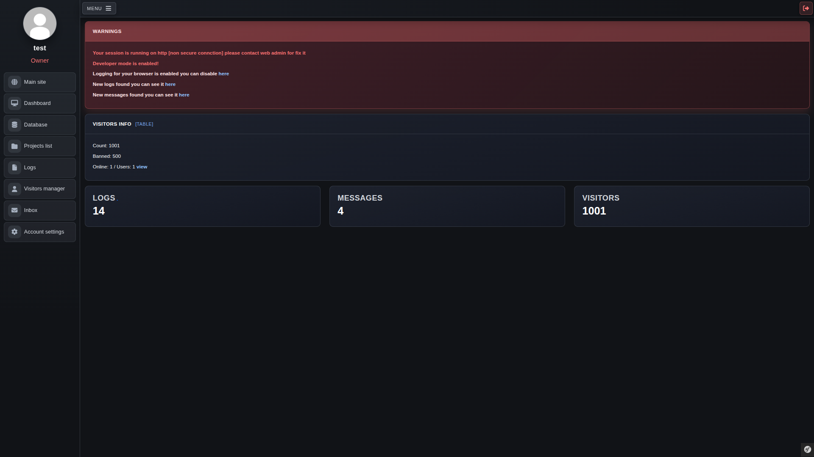

## About becvar-site
Personal website builded with the Symfony framework, Bootstrap & Webpack Encore.

## Admin site
The main part of this application is the admin panel, which contains functions and components for the administration of the host Linux server.

 - Account system with permissions
 - Warning system
 - Server dashboard
 - Services manager
 - Custom database viewer
 - Private todo manager
 - Media browser (image uploader)
 - Inbox for contact form
 - Advanced log system
 - Admin chat
 - Admin terminal (host server)
 - Server Emergency shutdown
 - Included adminer in the admin page

## Public site
The public part of the site contains information about me and my projects.

 - Main components: about, projects list, contact, etc...
 - Projects component gets repos from github (closed, open / Archived, Unarchived)
 - Image uploader / view
 - Code paste site

## Translations
 - Public page is automatically translated into visitor language (geolocation with ip address)

## Assets builder
 - Webpack (symfony-encore), scripts/build.sh

## Authenticator
 - This project uses my own authentication system, not Symfony security!
 - This authentication is designed to authenticate across my internal apps.
 - AuthManager contains functions for registration, login, logout, and user token authentication.

## Docker
Docker is used only for development in this application. The production version of the application runs directly on the host environment to simply connect the admin system to running services.

## Required packages & extensions
 - apache 
 - rpm
 - openssl
 - sudo
 - systemd
 - mysql8
 - php-8.3
 - php-curl
 - php-pdo
 - php-intl
 - php-dom
 - php-mysqli
 - nodejs-8 
 - npm-10

## Installation (with mysql/apache)
 - clone repository to your /www dir
 - disable apache autoindex module
 - configure apache config like [apache-site.conf](./docker/configs/apache-site.conf)
 - for production use only APP_ENV=prod! (in .env)
 - configure app enviroment in .env.prod
 - configure all values (mysql app secret etc)
 - install dependencies (scripts/install.sh)
 - migrate database structure (scripts/migrate.sh)
 - install opcache a acpu (optionally)

## Deployment
Deployment of the new version is ensured by a deploy GitHub Action when a new release is created, or you can use a deploy script.

## TODO
- [X] Email service
- [X] New login security email alert
- [X] Email send admin component
- [ ] Managers, middlewares & events unit tests
- [ ] Service monitoring
   - [ ] Monitor TCP/UDP/HTTP services status
   - [ ] Monitor HTTP response time
   - [ ] Admin monitroing dashboard
   - [ ] Monitoring async process
   - [ ] Send offline status email alert in email
   - [ ] Alert contact value in service config

## Dependencies
* Symfony
   * [Website](https://symfony.com/)   
* Adminer
   * [Website](https://www.adminer.org/)
* Bootstrap
   * [Website](https://getbootstrap.com/)
* Boxicons
   * [Website](https://boxicons.com/)
* Font-awesome
   * [Website](https://fontawesome.com)
* Purecounterjs
   * [Github](https://github.com/srexi/purecounterjs)
* Light-Gallery
   * [Github](https://github.com/sachinchoolur/lightGallery)
* Phpunit-Pretty-Print
   * [Github](https://github.com/indentno/phpunit-pretty-print)
   
## License
The framework is open-sourced software licensed under the [MIT license](https://opensource.org/licenses/MIT).
